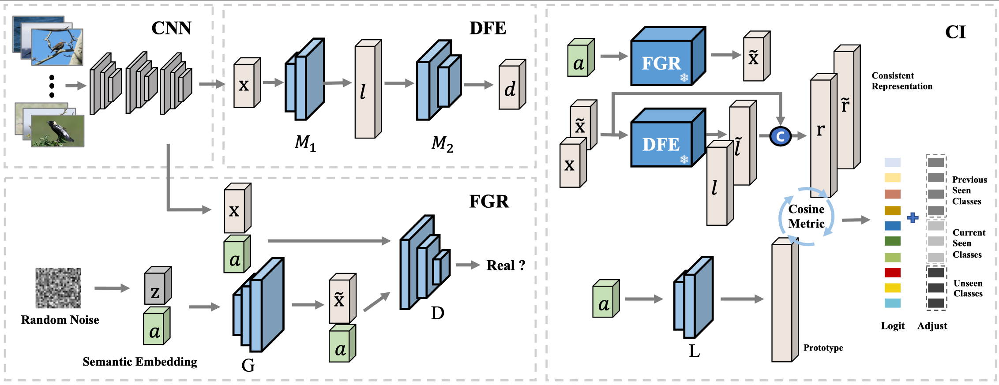

# Consistent Representation joint Adaptive Adjustment for Incremental Zero-Shot Learning


The code repository for "Consistent Representation joint Adaptive Adjustment for Incremental Zero-Shot Learning"


## CRAA: Consistent Representation joint Adaptive Adjustment

Zero-shot learning aims to recognize objects from novel concepts through the model trained on seen class data and assisted by the semantic descriptions. 
Though it breaks the serious reliance on training data, it still fails to deal with the sequential streaming data in the open world.
In this paper, we focus on the incremental zero-shot learning (IZSL) where the seen data arrives in the form of task sequence. 
In each incremental task, we only have access to the seen data of current task.
The IZSL methods aim to depict the characteristics of current seen classes and avoid forgetting the previous ones, in the meantime, learn to generalize to the unseen classes.
We summarize the challenges in IZSL as semantic drift which is further divided into task-recency bias and seen-class bias.
To solve these issues, we propose a novel IZSL method termed as CRAA.
Specifically, CRAA constructs consistent representations with satisfactory discrimination and generalization for all the seen and unseen classes.
Based on these representations, CRAA learns a prototype classifier with a novel adaptive adjustment strategy to alleviate the task-recency bias and seen-class bias. 
Note that CRAA only needs a limited memory footprint to store the fixed scale model, and meets the demands of both memory restriction and data security in industry.
We have conducted extensive experiments to evaluate our method on three widely used datasets. The results prove our method is superior to all the compared methods with significant improvements. 


<div align="center">
  


## Prerequisites

- [torch](https://github.com/pytorch/pytorch)
- [torchvision](https://github.com/pytorch/vision)
- [numpy](https://github.com/numpy/numpy)


## Training scripts

- Train CUB

  ```
  ./script/run_cub.py
  ```

- Train FLO

  ```
  ./script/run_flo.py
  ```

- Train SUN

  ```
  ./script/run_sun.py
  ```

## Contact

If there are any questions, please feel free to contact with the author: Chang Niu (eeniu@mail.scut.edu.cn) or (niuchang54@163.com)